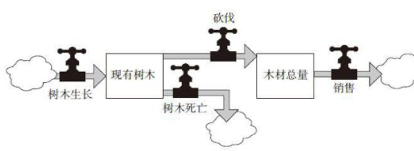
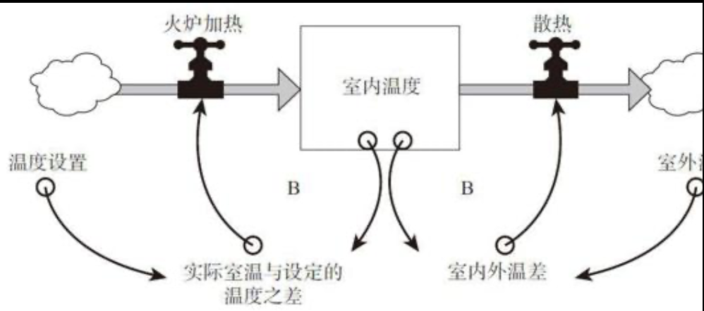
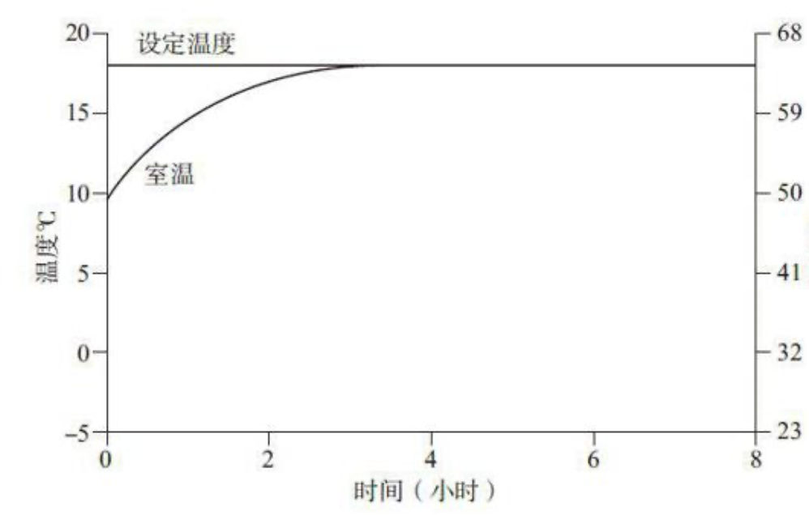

# 《系统之美》笔记

## 第一章
### 笔记
> “管理者所遇到的问题通常都不是彼此孤立的，而是相互影响、动态变化的，尤其是在由一系列复杂系统构成的动态情境之中。在这种情况下，管理者不能只是解决问题，而应善于管理混乱的局势。”

问题解决是途径，理清局势是关键

> “系统是一组相互连接的事物，在一定时间内，以特定的行为模式相互影响，例如人、细胞、分子等。系统可能受外力触发、驱动、冲击或限制，而系统对外力影响的反馈方式就是系统的特征。”

> “系统的内在结构决定了我们所不愿意看到的行为特征。”

> “不能只通过了解系统的各个构成部分来认识系统整体的行为。”

系统的构成要件：要素、连接、功能或目标。对于系统来说，整体大于部分之和。它具有适应性、动态性、目的性，并能自组织、自我保护与演进。

> “你应该从细究要素转向探寻系统内在的连接关系，即研究那些把要素整合在一起的关系”

1. 如何才能知道你观察的是系统而不是材料的集合？
2. 部分之间单独作用的影响和他们整合在一起的影响会有不同吗？

信息使系统整合在一起，并影响系统运作。  

通过分析系统的行为和运作，总结归纳，才能分析和表述出系统的功能和目标。

> “如果一只青蛙向右转捉住了一只苍蝇，然后向左转又捉住了另一只苍蝇，接着又向后转捉住了第三只苍蝇，那么我们就可以判断出青蛙的目的并非是向左、向右或向后转身，而是为了捕捉苍蝇。如果一个政府宣称要保护环境，却只为此拨付了很少量的资金，投入很少的精力，那么我们就可以判断出政府的实际目的并非保护环境。因此，必须通过实际行为来推断系统的目标，而不能只看表面的言辞或其标榜的目标。”

> “系统中最不明显的部分是它的功能或目标，而这常常是系统行为最关键的决定因素。”
“目标的变化会极大地改变一个系统，即使其中的要素和内在连接都保持不变。”  

> “尽管要素是我们最容易注意到的系统部分，但它对于定义系统的特点通常是最不重要的——除非是某个要素的改变也能导致连接或目标的改变”

> “存量”是所有系统的基础。所谓存量，是指在任何时刻都能观察、感知、计数和测量的系统要素。存量是对系统中变化量的一种历史记录。使其发生变化的是流量，指的是一段时间内改变的状况。”

> “借助行为模式图，我们可以判断系统是否正在趋向某个目标或极限点变化，也可以了解其变化的速度。在阅读这类图表时，要重点关注其变化模式，即表述变量数值变化的线条的形状和方向，相对来说具体的数字并不重要。”

> “人类的大脑似乎更加容易关注存量，而不是流量。更进一步地说，当我们关注流量时，我们更容易倾向于关注流入量，而不是流出量。“存量的变化需要时间，因为改变它的流量运作需要时间。“它们可能表现为延迟、欠货、缓存、压舱物以及系统中动量的源泉等。“存量，尤其是比较大的存量，在应对变化时，只能通过逐步的增加或释放来实现，即使对于突然的变化也是如此。”

> “人们经常低估存量的内在动量。“存量的变化一般比较缓慢，即使在流入量或流出量突然改变的情况下，也是如此。因此，存量可以在系统中起到延迟、缓存或减震器的作用。”

> “如果你对存量的变化速度有正确的认知，你就不会“拔苗助长”，期待事物变化的速度超出其特定规律；同时，你也不会过早地放弃，因为你知道一项措施要想见到成效，也需要时间；此外，你也可以更好地把握系统动量所展现的机会，“顺势而为”，就像一个高超的柔道选手善于利用对手的力量那样，聪明地实现自己的目标。”

> “由于存量的存在，流入量和流出量可以被分离开来，相互独立，并可以暂时地失衡。”

> ““人们不断地监控存量的变化，根据其状况和特定规则，制定决策并采取相应行动，以增加或降低存量水平，使其保持在可接受的范围内。系统思考者将世界视为各种“反馈过程”的组合。”

> “一个反馈回路就是一条闭合的因果关系链，从某一个存量出发，并根据存量当时的状况，经过一系列决策、规则、物理法则或者行动，影响到与存量相关的流量，继而又反过来改变了存量。”

> “这一类反馈回路具有保持存量稳定、趋向一个目标进行调节或校正的作用，我们称之为“调节回路,“在系统中，调节回路是保持平衡或达到特定目标的结构，也是稳定性和抵制变革的根源。”

> “第二类反馈回路的作用是不断放大、增强原有的发展态势，自我复制，像“滚雪球”一样。“它们是一个良性循环或恶性循环，既可能导致系统不断成长，越来越好；也可能像脱缰的野马，导致局势越来越差，造成巨大的破坏甚至毁灭。我们将这一类回路称为“增强回路,增强回路会强化系统原有的变化态势”

### 思考与总结
这里拿自己的学习系统举例子。目前自己的学习系统比较单薄，没有系统性的学习方法，在使用时也比较偏向于意识流“想到”，而不是一种系统有组织的分析框架。那么我如果要改变自己的学习系统，应该去改变什么，才能让它的复利不断提高？  
我想根据第一章学到的东西简单分析一下。  
首先想几件事，学习系统有什么要素，有什么连接，目标是什么？然后我从流量和存量的角度建模一下，然后发现其中的正负反馈分别是什么,以及他们对我的目标的作用。  
通过上面的分析，我的目标是要得出方法论和学习的系统方法。

## 第二章

### 笔记

单存量系统：一个存量、两个相互制衡的调节回路。  
典型代表：温度调节器。  

