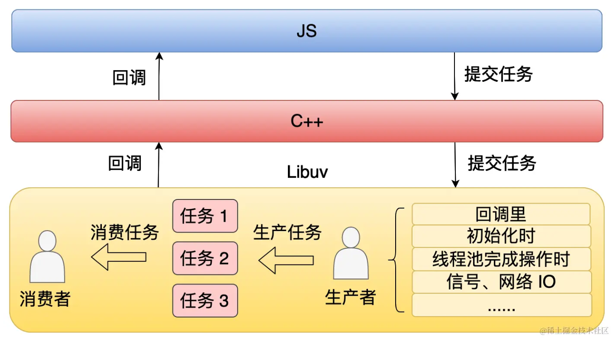
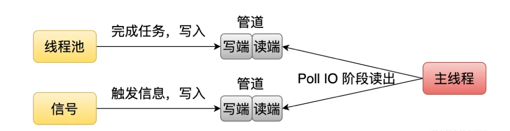
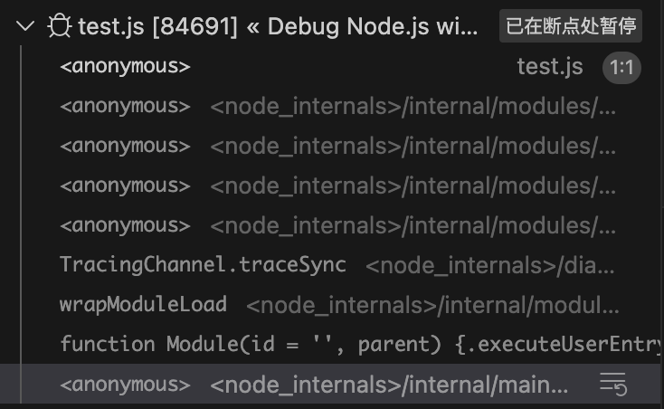
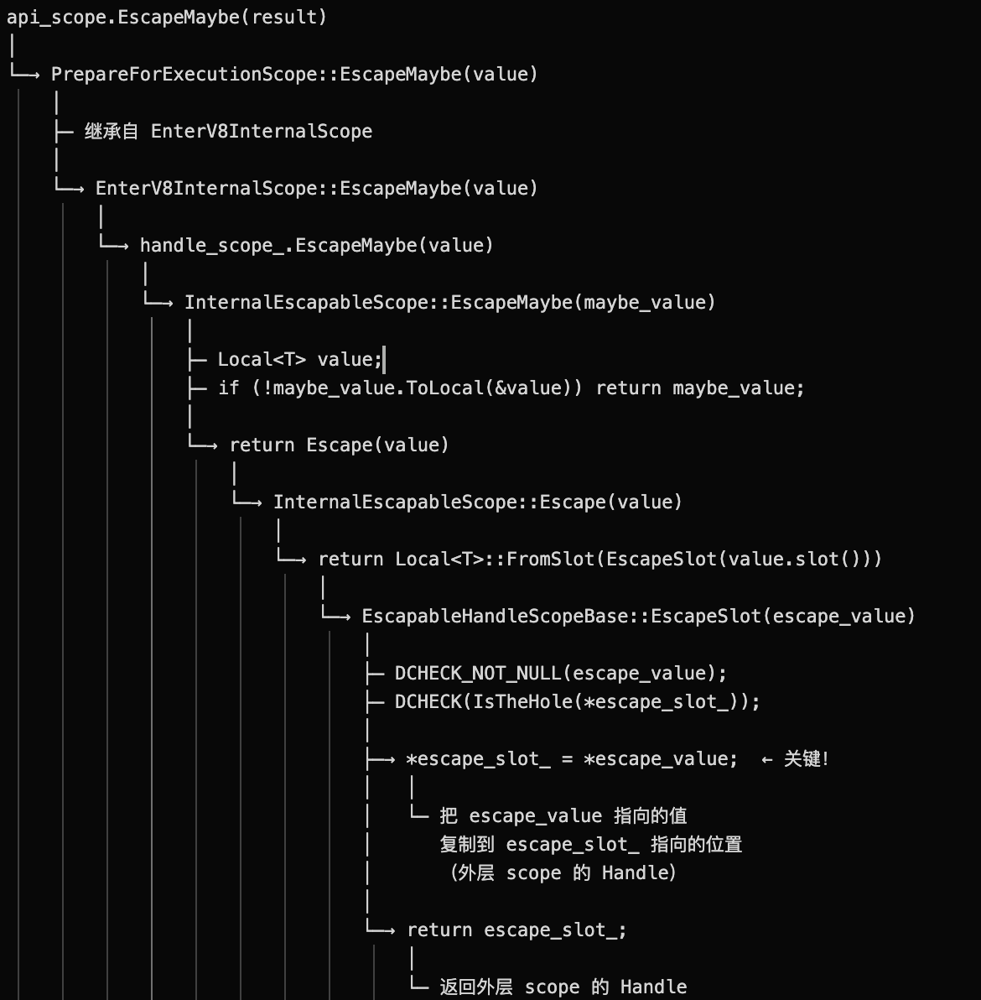

# Node事件循环

## 用户代码加载入口
node的核心机制就是事件循环，node在执行任务时，js层提交任务到c++层，c++层再提交到libuv内，在内部完成生产消费。Node分宏任务和微任务，这个和web思想一样，细节略有差别。


libuv采用线程池来执行异步任务，任务完成后不会直接调用回调，而是通知主线程。


所以第一步先搞清楚主链，也就是入口在哪，在哪提交任务，哪里处理任务，哪里返回结果，先把这一系列过程找出来。

在vscode里新建一个test文件打断点，然后找到调用栈最下面一层

下面开始找代码。
```js
require('internal/modules/cjs/loader').Module.runMain(mainEntry);
```
进去后是上面这种情况
```js
Module.runMain = require('internal/modules/run_main').executeUserEntryPoint;
```
然后顺着往里找
```js
function executeUserEntryPoint(main = process.argv[1]) {
  let useESMLoader;
  let resolvedMain;
  if (getOptionValue('--entry-url')) {
    useESMLoader = true;
  } else {
    resolvedMain = resolveMainPath(main);
    useESMLoader = shouldUseESMLoader(resolvedMain);
  }
  // Unless we know we should use the ESM loader to handle the entry point per the checks in `shouldUseESMLoader`, first
  // try to run the entry point via the CommonJS loader; and if that fails under certain conditions, retry as ESM.
  if (!useESMLoader) {
    const cjsLoader = require('internal/modules/cjs/loader');
    const { wrapModuleLoad } = cjsLoader;
    wrapModuleLoad(main, null, true);
  } else {
    const mainPath = resolvedMain || main;
    const mainURL = getOptionValue('--entry-url') ? new URL(mainPath, getCWDURL()) : pathToFileURL(mainPath);

    runEntryPointWithESMLoader((cascadedLoader) => {
      // Note that if the graph contains unsettled TLA, this may never resolve
      // even after the event loop stops running.
      return cascadedLoader.import(mainURL, undefined, { __proto__: null }, undefined, true);
    });
  }
}
```
接着往里，找到executeUserEntryPoint这个方法，看着就是加载用户文件的。process.argv[1]就是 `node xxx.js`里的`xxx.js`。  
```js
function shouldUseESMLoader(mainPath) {
  /**
   * @type {string[]} userLoaders A list of custom loaders registered by the user
   * (or an empty list when none have been registered).
   */
  const userLoaders = getOptionValue('--experimental-loader');
  /**
   * @type {string[]} userImports A list of preloaded modules registered by the user
   * (or an empty list when none have been registered).
   */
  const userImports = getOptionValue('--import');
  if (userLoaders.length > 0 || userImports.length > 0) { return true; }

  // Determine the module format of the entry point.
  if (mainPath && StringPrototypeEndsWith(mainPath, '.mjs')) { return true; }
  if (mainPath && StringPrototypeEndsWith(mainPath, '.wasm')) { return true; }
  if (!mainPath || StringPrototypeEndsWith(mainPath, '.cjs')) { return false; }

  if (getOptionValue('--strip-types')) {
    if (!mainPath || StringPrototypeEndsWith(mainPath, '.cts')) { return false; }
    // This will likely change in the future to start with commonjs loader by default
    if (mainPath && StringPrototypeEndsWith(mainPath, '.mts')) { return true; }
  }

  const type = getNearestParentPackageJSONType(mainPath);

  // No package.json or no `type` field.
  if (type === undefined || type === 'none') {
    return false;
  }

  return type === 'module';
}
```
上面是判断是否要启用ESMLoader，首先是看有没有一些options，然后是看后缀，这还不能确定就会执行一个`getNearestParentPackageJSONType`方法，这个方法声明自
`const { getNearestParentPackageJSONType } = internalBinding('modules');`后面要看下这个`internalBinding`。
```js
/**
 * Set up internalBinding() in the closure.
 * @type {import('typings/globals').internalBinding}
 */
let internalBinding;
{
  const bindingObj = { __proto__: null };
  // eslint-disable-next-line no-global-assign
  internalBinding = function internalBinding(module) {
    let mod = bindingObj[module];
    if (typeof mod !== 'object') {
      mod = bindingObj[module] = getInternalBinding(module);
      ArrayPrototypePush(moduleLoadList, `Internal Binding ${module}`);
    }
    return mod;
  };
}
```
这里的用了一个块闭包，主要是限制了bindingObj的可见性，外面不能直接访问到bindingObj。internalBinding做的事就是访问bindingObj里的对象，不存在就去`getInternalBinding`来拿。`ArrayPrototypePush`这句是设置process.moduleLoadList的。  
下面看下getInternalBinding
> // This file is compiled and run by node.cc before bootstrap/node.js  
// was called, therefore the loaders are bootstrapped before we start to  
// actually bootstrap Node.js. It creates the following objects:  
//  
// C++ binding loaders:  
// - process.binding(): the legacy C++ binding loader, accessible from user land  
//   because it is an object attached to the global process object.  
//   These C++ bindings are created using NODE_BUILTIN_MODULE_CONTEXT_AWARE()  
//   and have their nm_flags set to NM_F_BUILTIN. We do not make any guarantees  
//   about the stability of these bindings, but still have to take care of  
//   compatibility issues caused by them from time to time.  
// - process._linkedBinding(): intended to be used by embedders to add  
//   additional C++ bindings in their applications. These C++ bindings  
//   can be created using NODE_BINDING_CONTEXT_AWARE_CPP() with the flag  
//   NM_F_LINKED.  
// - internalBinding(): the private internal C++ binding loader, inaccessible  
//   from user land unless through `require('internal/test/binding')`.  
//   These C++ bindings are created using NODE_BINDING_CONTEXT_AWARE_INTERNAL()  
//   and have their nm_flags set to NM_F_INTERNAL.  
//  
// Internal JavaScript module loader:  
// - BuiltinModule: a minimal module system used to load the JavaScript core  
//   modules found in lib/**/*.js and deps/**/*.js. All core modules are  
//   compiled into the node binary via node_javascript.cc generated by js2c.  cc,  
//   so they can be loaded faster without the cost of I/O. This class makes   the  
//   lib/internal/*, deps/internal/* modules and internalBinding() available by  
//   default to core modules, and lets the core modules require itself via  
//   require('internal/bootstrap/realm') even when this file is not written in  
//   CommonJS style.  
//
// Other objects:  
// - process.moduleLoadList: an array recording the bindings and the modules  
//   loaded in the process and the order in which they are loaded.  

根据注释，这个文件会被node.cc运行，早于nodejs环境启动之前。会加载各种cpp或者js的module loader和lib。包括`getInternalBinding`这个方法。  
注释说`node::RunBootstrapping()`，下面就找下这个方法。
```cpp
MaybeLocal<Value> Realm::RunBootstrapping() {
  EscapableHandleScope scope(isolate_);

  CHECK(!has_run_bootstrapping_code());

  Local<Value> result;
  if (!ExecuteBootstrapper("internal/bootstrap/realm").ToLocal(&result) ||
      !BootstrapRealm().ToLocal(&result)) {
    return MaybeLocal<Value>();
  }

  DoneBootstrapping();

  return scope.Escape(result);
}
```
这个方法在node_realm.cc文件里。看下`ExecuteBootstrapper`和`BootstrapRealm`两个
```cpp
MaybeLocal<Value> Realm::ExecuteBootstrapper(const char* id) {
  EscapableHandleScope scope(isolate());
  Local<Context> ctx = context();
  MaybeLocal<Value> result =
      env()->builtin_loader()->CompileAndCall(ctx, id, this);

  // If there was an error during bootstrap, it must be unrecoverable
  // (e.g. max call stack exceeded). Clear the stack so that the
  // AsyncCallbackScope destructor doesn't fail on the id check.
  // There are only two ways to have a stack size > 1: 1) the user manually
  // called MakeCallback or 2) user awaited during bootstrap, which triggered
  // _tickCallback().
  if (result.IsEmpty()) {
    env()->async_hooks()->clear_async_id_stack();
  }

  return scope.EscapeMaybe(result);
}
```
看上去是从环境里加载builtin_loader，然后编译和调用id对应的文件。这里的id指的是`internal/bootstrap/realm`，看下这个文件是啥。  
主要在`CompileAndCall`里，里面关键的是`LoadBuiltinSource`，跳转到实现，里面有一个
```cpp
 auto source = source_.read();
  const auto source_it = source->find(id);
  if (source_it == source->end()) [[unlikely]] {
    fprintf(stderr, "Cannot find native builtin: \"%s\".\n", id);
    ABORT();
  }
```
关键就是看source是读什么，以及如何在里面找的id了。这个source_是BuiltinLoader的一个成员变量，需要看下在哪初始化的。
```cpp
BuiltinLoader::BuiltinLoader()
    : config_(GetConfig()), code_cache_(std::make_shared<BuiltinCodeCache>()) {
  LoadJavaScriptSource();

    // ...
}
```
在构造方法中，有一个`LoadJavaScriptSource`，内部
```cpp
void BuiltinLoader::LoadJavaScriptSource() {
  source_ = global_source_map;
}
```
这个文件node_javascript非常大，在里面定义了一个巨大的`global_source_map`,下面是一部分
```cpp
{"internal/bootstrap/realm", BuiltinSource{ "internal/bootstrap/realm", UnionBytes(&internal_bootstrap_realm_resource), BuiltinSourceType::kBootstrapRealm} }
```
这个id的指向要看`internal_bootstrap_realm_resource`
```cpp
static StaticExternalOneByteResource internal_bootstrap_realm_resource(internal_bootstrap_realm_raw, 15448, nullptr);
```
然后是`internal_bootstrap_realm_raw`
```cpp
static const uint8_t *internal_bootstrap_realm_raw = reinterpret_cast<const uint8_t*>(R"JS2C1b732aee(// This file is executed in every realm that is created by Node.js, including
// the context of main thread, worker threads, and ShadowRealms.
// Only per-realm internal states and bindings should be bootstrapped in this
// file and no globals should be exposed to the user code.
// ....
)JS2C1b732aee");
```
里面这串字符串，其实就是刚才那个realm.js里的内容，只是通过脚本的方式把源代码变成cpp的文本作为字符串传给一个变量了。
现在看`StaticExternalOneByteResource`这个类
```cpp
using StaticExternalOneByteResource =
    StaticExternalByteResource<uint8_t,
                               char,
                               v8::String::ExternalOneByteStringResource>;

// StaticExternalByteResource的构造函数
explicit StaticExternalByteResource(const Char* data,
                                      size_t length,
                                      std::shared_ptr<void> owning_ptr)
      : data_(data), length_(length), owning_ptr_(owning_ptr) {}
```
`StaticExternalOneByteResource`就是个Descriptor，描述了数据的类型，长度，以及指针。  
`_source`的类型是`ThreadsafeCopyOnWrite<BuiltinSourceMap>`，所以_source.read()就是读取这个map了。  
读到`BuiltinSource`之后，就会编译这个Source，因为`internal/bootstrap/realm`的类型是`kBootstrapRealm`,所以执行的是
```cpp
switch (builtin_source->type) {
    case BuiltinSourceType::kBootstrapRealm: {
      Local<Value> get_linked_binding;
      Local<Value> get_internal_binding;
      if (!NewFunctionTemplate(isolate, binding::GetLinkedBinding)
               ->GetFunction(context)
               .ToLocal(&get_linked_binding) ||
          !NewFunctionTemplate(isolate, binding::GetInternalBinding)
               ->GetFunction(context)
               .ToLocal(&get_internal_binding)) {
        return MaybeLocal<Value>();
      }
      Local<Value> arguments[] = {realm->process_object(),
                                  get_linked_binding,
                                  get_internal_binding,
                                  realm->primordials()};
      return fn->Call(context, receiver, 4, arguments);
    }
    // ...
}
```
这一段就是刚才想看到的核心了，它主要做的就是往isolate里注入cpp原生函数。
先回顾下`context`是
```cpp
// node_realm.cc
MaybeLocal<Value> Realm::ExecuteBootstrapper(const char* id) {
  EscapableHandleScope scope(isolate());
  Local<Context> ctx = context();
  MaybeLocal<Value> result =
      env()->builtin_loader()->CompileAndCall(ctx, id, this);
  // ...
}

v8::Local<v8::Context> Realm::context() const {
  return PersistentToLocal::Strong(context_);
}

// node_realm.h
class Realm : public MemoryRetainer {
    public:
    v8::Global<v8::Context> context_;
}
```
初始化的位置在
```cpp
Realm::Realm(Environment* env, v8::Local<v8::Context> context, Kind kind)
    : env_(env), isolate_(Isolate::GetCurrent()), kind_(kind) {
  context_.Reset(isolate_, context);
  env->AssignToContext(context, this, ContextInfo(""));
  // The environment can also purge empty wrappers in the check callback,
  // though that may be a bit excessive depending on usage patterns.
  // For now using the GC epilogue is adequate.
  isolate_->AddGCEpilogueCallback(PurgeEmptyCppgcWrappers, this);
}

// v8-persistent-handle.h
/**
 * If non-empty, destroy the underlying storage cell
 * and create a new one with the contents of other if other is non empty
 */
template <class T>
template <class S>
void PersistentBase<T>::Reset(Isolate* isolate,
                              const PersistentBase<S>& other) {
  static_assert(std::is_base_of_v<T, S>, "type check");
  Reset();
  if (other.IsEmpty()) return;
  this->slot() = New(isolate, other.template value<S>());
}

template <class T>
void PersistentBase<T>::Reset() {
  if (this->IsEmpty()) return;
  api_internal::DisposeGlobal(this->slot());
  this->Clear();
}
```
核心在于`AssignToContext`这个方法，
```cpp
void Environment::AssignToContext(Local<v8::Context> context,
                                  Realm* realm,
                                  const ContextInfo& info) {
  context->SetAlignedPointerInEmbedderData(ContextEmbedderIndex::kEnvironment,
                                           this,
                                           EmbedderDataTag::kPerContextData);
  context->SetAlignedPointerInEmbedderData(
      ContextEmbedderIndex::kRealm, realm, EmbedderDataTag::kPerContextData);

  // ContextifyContexts will update this to a pointer to the native object.
  context->SetAlignedPointerInEmbedderData(
      ContextEmbedderIndex::kContextifyContext,
      nullptr,
      EmbedderDataTag::kPerContextData);

  // This must not be done before other context fields are initialized.
  ContextEmbedderTag::TagNodeContext(context);

#if HAVE_INSPECTOR
  inspector_agent()->ContextCreated(context, info);
#endif  // HAVE_INSPECTOR

  this->async_hooks()->InstallPromiseHooks(context);
  TrackContext(context);
}
```
这个方法就是把各种环境(Environment/Realm/ContextifyContext)存到Context里建立映射。  
执行到`compileAndCall`的时候，已经有V8实例了，所以`isolate()`和`context()`就是拿已有实例的handler。  
其实上面跳过node.cc的初始化环境到执行bootstrap之前的步骤。这里先暂时不看，总之`Environment`和`Realm`已经创建了。  
综上，简单理解成初始化过程中，先把context里当前的上下文都清空，然后重新创建一个新的出来。`ContextInfo("")`是调试用的可以先不管。需要注意的是这里的上下文都是完整的V8上下文，Isolate是V8的实例的概念。  
`CompileAndCall`里还有一步
```cpp
if (builtin_source->type == BuiltinSourceType::kSourceTextModule) {
    Local<Value> value;
    if (!ImportBuiltinSourceTextModule(realm, id).ToLocal(&value)) {
      return MaybeLocal<Value>();
    }
    return value;
  }

Local<Data> data;

if (!LookupAndCompile(context, builtin_source, realm).ToLocal(&data)) {
    return MaybeLocal<Value>();
  }
  CHECK(data->IsValue());
  Local<Value> value = data.As<Value>();
  CHECK(value->IsFunction());
  Local<Function> fn = value.As<Function>();
  Local<Value> receiver = Undefined(Isolate::GetCurrent());
```
首先if中判断了BuiltinSourceType::kSourceTextModule这种类型，它对应的是Local\<Module\>这种资源，处理后，后面就只会有一种资源类型（Function）。  
`LookupAndCompile`，这个方法非常长，简单来说就是查找缓存，然后根据编译策略和资源类型(函数或者模块)，对源码进行编译，编译后进行缓存并返回。在这里检查了data是什么，Data是一个基类，具体的继承关系是`Data->Value->Object->Function`。

```cpp
!NewFunctionTemplate(isolate, binding::GetInternalBinding)
               ->GetFunction(context)
               .ToLocal(&get_internal_binding)

// api.cc
Local<FunctionTemplate> FunctionTemplate::New(
    Isolate* v8_isolate, FunctionCallback callback, ...) {

  // ...

  i::DirectHandle<i::FunctionTemplateInfo> templ = FunctionTemplateNew(
      i_isolate, callback, data, signature, length, behavior, false,
      Local<Private>(), side_effect_type,
      c_function ? MemorySpan<const CFunction>{c_function, 1}
                 : MemorySpan<const CFunction>{});

  // ...

  return Utils::ToLocal(templ);
}

// api.cc
i::DirectHandle<i::FunctionTemplateInfo> FunctionTemplateNew(
    i::Isolate* i_isolate, FunctionCallback callback, ...) {
  i::DirectHandle<i::FunctionTemplateInfo> obj =
      i_isolate->factory()->NewFunctionTemplateInfo(length, do_not_cache);

  if (callback != nullptr) {
    Utils::ToLocal(obj)->SetCallHandler(callback, data, side_effect_type,
                                        c_function_overloads);
  }
  return obj;
}

//
void FunctionTemplate::SetCallHandler(
    FunctionCallback callback, v8::Local<Value> data,
    SideEffectType side_effect_type,
    const MemorySpan<const CFunction>& c_function_overloads) {
  auto info = Utils::OpenDirectHandle(this);
  EnsureNotPublished(info, "v8::FunctionTemplate::SetCallHandler");
  i::Isolate* i_isolate = i::Isolate::Current();
  EnterV8NoScriptNoExceptionScope api_scope(i_isolate);
  i::HandleScope scope(i_isolate);
  info->set_has_side_effects(side_effect_type !=
                             SideEffectType::kHasNoSideEffect);
  info->set_callback(i_isolate, reinterpret_cast<i::Address>(callback));
  if (data.IsEmpty()) {
    data = v8::Undefined(reinterpret_cast<v8::Isolate*>(i_isolate));
  }
  // "Release" callback and callback data fields.
  info->set_callback_data(*Utils::OpenDirectHandle(*data), kReleaseStore);

  if (!c_function_overloads.empty()) {
    // Stores the data for a sequence of CFunction overloads into a single
    // FixedArray, as [address_0, signature_0, ... address_n-1, signature_n-1].
    i::DirectHandle<i::FixedArray> function_overloads =
        i_isolate->factory()->NewFixedArray(static_cast<int>(
            c_function_overloads.size() *
            i::FunctionTemplateInfo::kFunctionOverloadEntrySize));
    int function_count = static_cast<int>(c_function_overloads.size());
    for (int i = 0; i < function_count; i++) {
      const CFunction& c_function = c_function_overloads.data()[i];
      i::DirectHandle<i::Object> address = FromCData<internal::kCFunctionTag>(
          i_isolate, c_function.GetAddress());
      function_overloads->set(
          i::FunctionTemplateInfo::kFunctionOverloadEntrySize * i, *address);
      i::DirectHandle<i::Object> signature =
          FromCData<internal::kCFunctionInfoTag>(i_isolate,
                                                 c_function.GetTypeInfo());
      function_overloads->set(
          i::FunctionTemplateInfo::kFunctionOverloadEntrySize * i + 1,
          *signature);
    }
    i::FunctionTemplateInfo::SetCFunctionOverloads(i_isolate, info,
                                                   function_overloads);
  }
}

```

这里先看创建函数这一层，本质就是创建一个v8函数模版，在`i_isolate->factory()->NewFunctionTemplateInfo`里给这个函数分配了内存，然后把cpp函数注册上去。  
核心是`setCallHandler`这个方法，内部一开始就是得到各种类，比如v8实例、作用域等等，然后设置各种各样的东西，主要是把函数指针设置上去`info->set_callback(i_isolate, reinterpret_cast<i::Address>(callback));`,如果有重载，下面还在处理重载情况。  

`GetFunction`是实际创建的地方，上面那个有点类似于Builder，GetFunction是build方法。
```cpp
MaybeLocal<v8::Function> FunctionTemplate::GetFunction(Local<Context> context) {
  PrepareForExecutionScope api_scope{context,
                                     RCCId::kAPI_FunctionTemplate_GetFunction};
  i::Isolate* i_isolate = api_scope.i_isolate();
  auto self = Utils::OpenDirectHandle(this);
  return api_scope.EscapeMaybe(i::ApiNatives::InstantiateFunction(
      i_isolate, i_isolate->native_context(), self));
}
```

简单看下，就是把函数(this/self)实例化`i::ApiNatives::InstantiateFunction`到api_scope里。api_scope是V8里的一个对象的生命周期。  
这里的`EscapeMaybe`有个非常精细的副作用
```cpp

i::Address* EscapableHandleScopeBase::EscapeSlot(i::Address* escape_value) {
  DCHECK_NOT_NULL(escape_value);
  DCHECK(i::IsTheHole(i::Tagged<i::Object>(*escape_slot_),
                      reinterpret_cast<i::Isolate*>(GetIsolate())));
  *escape_slot_ = *escape_value;
  return escape_slot_;
}
```
这里的调用关系是这样的

当EscapeMaybe的时候，在scope内部实例化的函数会被` *escape_slot_ = *escape_value;`复制到外部scope中。**因此创建出的函数实际上已经挂载在V8实例上了**。  
```cpp
 Local<Value> arguments[] = {realm->process_object(),
                                  get_linked_binding,
                                  get_internal_binding,
                                  realm->primordials()};
      return fn->Call(context, receiver, 4, arguments);
```
最后执行了编译后的fn


推到这一步其实差不多倒推了Node初始化环境后到加载用户代码这一段流程，核心就是弄明白getInternalBinding怎么来的。但是上面其实很多地方还没讲清楚，尤其是`AssignToContext`里到底绑定了什么，以及